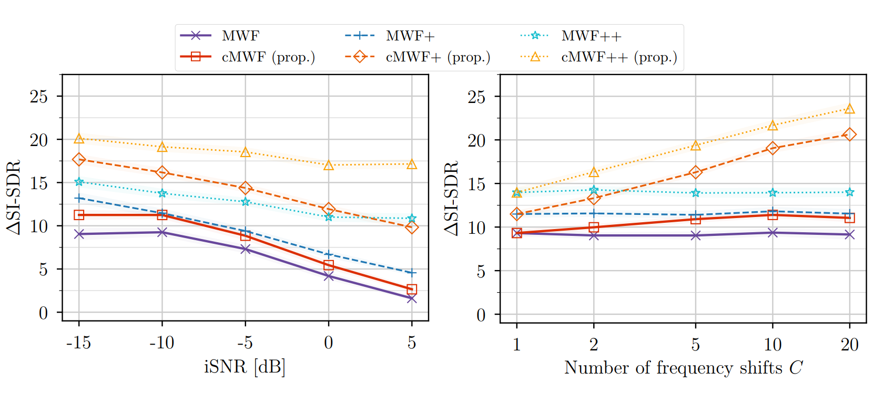

# Cyclic multichannel Wiener filter (cMWF) for acoustic beamforming

## Introduction
This code accompanies the paper *"Cyclic multichannel Wiener filter for acoustic beamforming"*, 
accepted in WASPAA 2025 (arXiv: https://arxiv.org/abs/2507.10159).



The paper proposes a new beamforming method leveraging the cyclostationarity of voiced speech signals.  
By exploiting correlations across microphones and frequency components, the cyclic multichannel Wiener filter (cMWF) 
improves noise reduction in low-SNR scenarios.

---

## Installation and first run

### Prerequisites
- Python 3.9 (for compatibility with librosa)
- Tested on macOS 14.4.1 but should run on most Linux systems.

### Setup
1. Clone the repository:
```bash
   git clone git@github.com:Screeen/cyclicMWF.git
   cd cyclicMWF
```

2. Create and activate a Python virtual environment:
```bash
   python3.9 -m venv .venv
   source .venv/bin/activate
```

3. Install required packages:
```bash
   pip install --upgrade pip
   uv add  # requires the `uv` package for managing virtual environments
   # (or if you prefer:)
   # pip install -r requirements.txt
```

## fast_nls_src compilation

We use the `fastF0Nls` library for pitch estimation, which requires compilation. See https://github.com/jkjaer/fastF0Nls for instructions.

---

## Running experiments

### Configurations
Experiment parameters are controlled via YAML files in the `configs/` folder. Edit `default.yaml` and `cmwf.yaml` to set your desired parameters such as:
- `data_type` (choose from 'synthetic', 'instruments', or 'speech')
- `num_montecarlo_simulations`
- ... 

### Example runs
Run synthetic data experiments:
  ```bash
  python main.py
  ```

### Notes
- Real data experiments require downloading room impulse responses, clean speech, and instrument samples:
- RIRs: https://www.iks.rwth-aachen.de/en/research/tools-downloads/databases/multi-channel-impulse-response-database/
- Instrument samples:  https://theremin.music.uiowa.edu/MIS.html.
- Speech: Speech Intelligibility CD by Neil Thompson Shade

## Troubleshooting

If you get
```
ImportError: cannot import name 'kaiser' from 'scipy.signal' (.../.venv/lib/python3.X/site-packages/scipy/signal/__init__.py). Did you mean: 'kaiserord'?
```
Open the file
```
nano .../SVD-direct/env/lib/python3.X/site-packages/pysepm/util.py
```
and replace 
```
from scipy.signal import firls,kaiser,upfirdn
```
with
```
from scipy.signal import firls,upfirdn
from scipy.signal.windows import kaiser
```

---

> [!NOTE]
> Feedback and questions welcome: G.Bologni@tudelft.nl.
> Enjoy experimenting with cMWF!
> 
